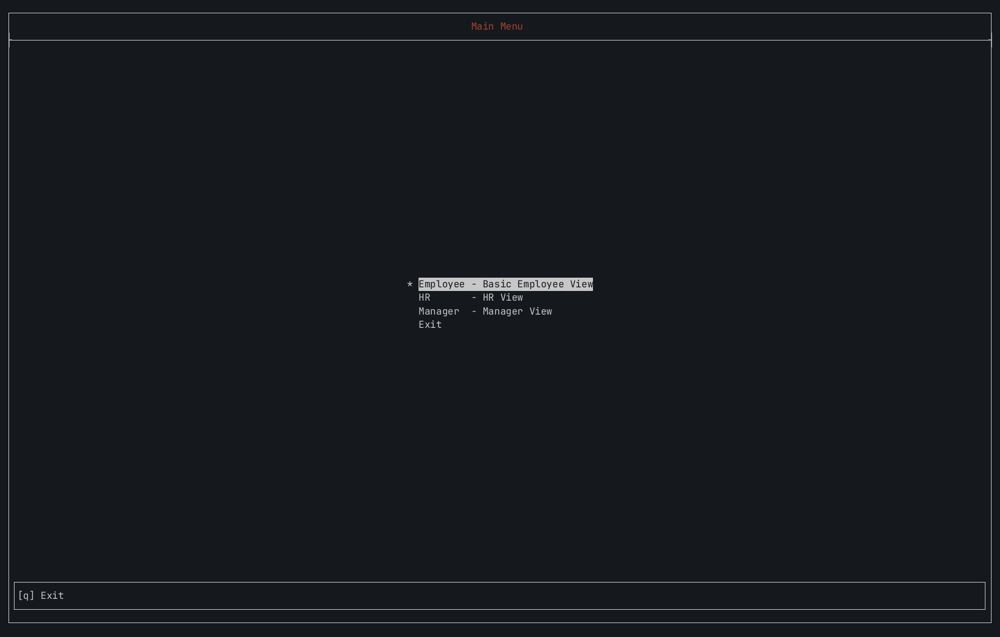

# Payrolls



A TUI payroll system in standard C++17 (lol). With VIM-style motions, its own panel-based view router, a custom flexbox-like layout engine over ncurses UI, and SQLite persistence via SQLiteCpp. No framework GUI, no ORM: the router, the layout math, and the focus/navigation model are all built from scratch against raw ncurses primitives.

This project started as a CSC430 (Software Engineering) group project at CUNY College of Staten Island, a Windows Forms / C++/CLI / Microsoft Access app built to course spec.

This version exists purely as a learning device to shake off my rusty c++ skills after not touching the language seriously since college.

---

## What's here now

- **CMake build**, no IDE dependency. SQLiteCpp pulled via `FetchContent`. `-Wall -Wextra -Wpedantic -Werror`, plus `.clang-format` and `.clang-tidy` enforced pre-commit.
- **Panel-based view router** (`App`): singleton owns a view stack, pushes/pops `PANEL*`s, flush per frame instead of per-view `wrefresh`. Somewhat mimicked [TheCherno's Architecture](https://github.com/TheCherno/Architecture) layout for further inspiration.
- **Custom layout engine** (`LayoutNode` / `assign_rects`): weighted row/column splits over a `WINDOW*`, recursively carving `Rect`s for child sections implemented directly against ncurses geometry.
- **`View` → `Section` composition**: a `View` is a full-screen window holding a `LayoutNode` tree of `Section`s (bordered panes). Focus moves between sections with vim-style `H`/`J`/`K`/`L`, each `View` declares its own key hints rendered in the footer. I Django professionally so my thought processes worked in those terms here.
- **`ScrollList`**: reusable scrollable list built on ncurses `MENU*`, used for paystub history.
- **SQLite persistence**: schema in `data/migrations/`. Repos wrap `SQLiteCpp` and hand back plain structs (`Employee`, `Compensation`, `Benefit`, `Paystub`).
- **RAII everywhere**: `NcursesGuard` wraps `initscr`/`endwin`; every `WINDOW*`/`PANEL*`/`MENU*` owner cleans up in its destructor; copy/move deleted where ownership can't be shared. probably could've done this better but hey it's a learning project.

**Working right now:** landing menu → Employee view, wired to real SQLite data (hardcoded to an employee id=1 but would work for any ofc): employee info, compensation, latest paystub, benefit elections, and a benefits-request panel, laid out via the layout engine and navigable by keyboard.

## What's not here and why

**Not wired yet:**

- login/auth (schema has `password_hash`, no screen uses it).
- HR and Manager routes (menu options exist, not implemented).
- add/update/remove employee flows.
- the state tax classes (`FedTax`, `NYTax`, `NJTax`, `CTTax`), which are still flat-rate stand-ins from the original. Correct marginal-bracket math and a shared `Tax` base class are still TODO.
- run_migrations() or any automatic DB creation.
- Proper Exception/Error handling - mainly because I'm over this project and will tackle it in whatever I do next
- Unit test - maybe since it should be easy enough with this project. Business logic is straight forward, but again I'm bored of this project.

Idk if I'll ever get around to finishing these since I basically touched on all the concepts I wanted to here, but who knows.
I stopped here because the last few times I've worked on this it felt more like I was trying to design a c++ wrapper or framework over ncurses which was beyond the scope of what I wanted to accomplish here. Good exercise but not worth the squeeze.

---

## Build & run

Initalize and create DB (one time only):

```sh
sqlite3 payrolls.db < data/migrations/001_initial.sql
sqlite3 payrolls.db < data/migrations/seed.sql
```

Then build and run:

```sh
cmake -S . -B build && cmake --build build && ./build/csi_payrolls
```

Run from the repo root: `payrolls.db` is opened by relative path.

Requires `ncurses` (with `panel` and `menu`) and `sqlite3` on your system; SQLiteCpp and its SQLite3 are fetched and built automatically.

There is no migration manager yet. `Database::run_migrations()` is a stub and is not called. Querying an unseeded database throws `SQLite::Exception`, which is currently uncaught and aborts the process.

---

## Architecture

```
App (singleton, owns view_stack_: vector<unique_ptr<View>>)
 │  navigate_to<T>() hides top panel, pushes new one
 │  run() loop → update_panels(); doupdate()   (single flush per frame)
 │
 └─ EmployeeView : View
     │  owns view_win_ (fullscreen WINDOW*) + PANEL*
     │  owns root_node_: LayoutNode
     │
     └─ root_node_ (Row)
         ├─ LayoutNode (Col)                    weight 1
         │   ├─ EmployeeInfoSection             weight 3
         │   └─ LayoutNode (Row)                weight 1
         │       ├─ EmployeeBenefitsSection      weight 2
         │       └─ BenefitsRequestSection        weight 1
         │
         └─ EmployeePayrollSection              weight 1
             └─ ScrollList (paystub history, ncurses MENU*)
```

`assign_rects()` walks the tree once at construction, splitting `Rect`s by weight along each node's `Axis` (Row/Col) and handing each leaf `Section` its own sub-rect (no live terminal-resize handling yet). Each `Section` owns a `derwin`'d child `WINDOW*` inside `view_win_` and draws only itself. Focus is tracked as a single `Section*` on the `View`; `H`/`J`/`K`/`L` walk the same tree to retarget it.

---

## Stack, then vs. now

| Area                | Original                                 | This version                         |
| ------------------- | ---------------------------------------- | ------------------------------------ |
| Language            | C++/CLI (`System::String^`, `ref class`) | Standard C++17                       |
| Build               | Visual Studio `.sln`                     | CMake                                |
| Database            | Microsoft Access (`.accdb`)              | SQLite via SQLiteCpp                 |
| UI                  | Windows Forms (designer-generated)       | ncurses TUI, own panel/layout system |
| Directory structure | Flat, one folder                         | `include/`, `src/`, `data/`          |

---

## Original submission (for reference)

- C++/CLI targeting .NET, MSVC/Windows only
- Windows Forms UI (`.resx` designer files)
- Microsoft Access (`.accdb`) storage
- Visual Studio `.sln` build

Source for the original is kept in `Payrolls/` for reference; it's not maintained.

---

## A note on the repo history

This started as a fork of the original College of Staten Island CSC430 group repo. It's a standalone repository now, for full independence and not much of the original code would make it past the refactor. Idk if I should even keep calling it a refactor since the bulk of the old code was garbage UI code.

Back in college we committed the Microsoft Access databases (`Payroll_InfoDone.accdb`, `PreviousEmployees.accdb`) straight into the repo. They _were_ the database: no schema file, no migrations, no seed script, just two binaries you pointed `ConnectionPath.h` at. We didn't know any better, and the course deadline didn't care. If we knew any better than we would've just done a web app instead... not a C++ UI scraped together by Visual Studio the grace of God or Microsoft Access files as a database.

The MS Access files were deleted as of the SQLite migration. The schema lives in `data/migrations/` now.

I left them in the git history until then purposely so I didn't have to re-download them once I got to doing the DB. Yes I could've gitignored them, I was lazy. It's all dummy data we made up for the assignment, so there's nothing of value that was leaked by committing anyway.
